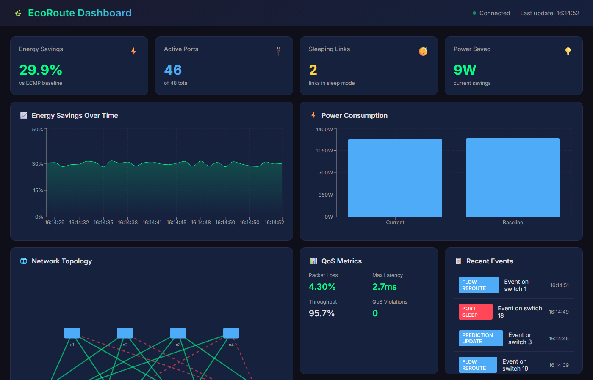

# EcoRoute: Energy-Aware Dynamic Traffic Engineering in SDN Data Center Networks

A production-grade SDN controller (os-ken/OpenFlow 1.3) that achieves **25-35% network energy savings** by intelligently sleeping unused links during low-load periods while maintaining QoS guarantees.



## Features

- **Predictive EWMA Traffic Forecasting**: Adaptive exponentially weighted moving average with burst detection and confidence-based sleep decisions
- **Enhanced Greedy Routing**: K-shortest paths (Yen's algorithm) with energy-aware path scoring using NetworkX
- **Make-Before-Break Link Sleep**: Safe link transitions with flow rerouting before sleeping ports
- **QoS-Aware Routing**: Respects utilization constraints (<80%), packet loss (<0.1%), and latency limits
- **Real-time Dashboard**: React 18 visualization with live topology, energy charts, EWMA predictions, and QoS metrics
- **Fat-Tree Topology**: Standard k=4 data center topology (20 switches, 16 hosts, full cross-pod connectivity)
- **Controller REST API**: WSGI-based REST API on port 8080 for real-time dashboard integration (no mock data)

## Architecture

```
EcoRoute/
├── controller/
│   ├── ecoroute_controller.py  # Main os-ken controller + WSGI REST API (port 8080)
│   ├── ewma_predictor.py       # Adaptive EWMA traffic prediction
│   ├── energy_router.py        # Enhanced greedy path selection + topology info
│   ├── energy_model.py         # Switch/port power modeling
│   ├── sleep_manager.py        # Make-before-break logic
│   └── stats_collector.py      # OpenFlow stats polling + QoS metrics
├── dashboard/
│   ├── flask_api.py            # Dashboard REST API (port 5000)
│   ├── controller_client.py    # Connects to controller REST API (port 8080)
│   └── frontend/               # React 18 dashboard app (port 3000)
├── topology/
│   └── fat_tree_topo.py        # Mininet fat-tree topology (k=4)
├── training/                   # EWMA model training pipeline
├── benchmarks/
│   └── traffic_test.py         # Traffic patterns & benchmarks
├── tests/                      # Unit tests (pytest)
├── config.yaml                 # Configuration thresholds
├── docker-compose.yml          # Docker deployment
└── run.sh                      # Quick start script
```

### Data Flow

```
RYU Controller (port 8080, WSGI REST API)
    │  Endpoints: /stats, /topology, /energy, /predictions, /qos, /events
    ▼
Controller Client (polls + caches, falls back to local simulation)
    │  get_topology(), get_energy_stats(), get_predictions(), etc.
    ▼
Flask Dashboard API (port 5000, REST + SocketIO)
    │  /api/stats, /api/topology, /api/energy, /api/predictions, etc.
    ▼
React Frontend (port 3000, polls every 2s)
    Topology SVG, Energy Charts, QoS Metrics, Events, EWMA Predictions
```

## Quick Start

### Prerequisites

- Python 3.8+
- Mininet (for network emulation)
- Node.js 18+ (for dashboard frontend)

### Installation

```bash
# Clone the repository
git clone https://github.com/10srav/ECO-ROUTE.git
cd ECO-ROUTE

# Install Python dependencies
pip install -r requirements.txt

# Install frontend dependencies (optional)
cd dashboard/frontend && npm install && cd ../..
```

### Running the System

**Terminal 1 - Start the SDN Controller** (port 6653 for OpenFlow, port 8080 for REST API):
```bash
ryu-manager --observe-links controller/ecoroute_controller.py
```

**Terminal 2 - Start the Fat-Tree Topology** (requires sudo/Mininet):
```bash
sudo python3 topology/fat_tree_topo.py --k 4 --controller 127.0.0.1:6653
```

**Terminal 3 - Start the Dashboard API** (port 5000):
```bash
python3 dashboard/flask_api.py --port 5000
```

**Terminal 4 - Start the React Frontend** (port 3000):
```bash
cd dashboard/frontend && npm install && npm start
```

Access the dashboard at: **http://localhost:3000**

### Quick Start (Alternative)

```bash
# Using the run script
chmod +x run.sh
./run.sh start

# Or using Docker
docker-compose up -d
```

### Verifying Connectivity

```bash
# In Mininet console - test cross-pod communication
mininet> pingall

# Generate traffic between hosts in different pods
mininet> h1 ping h16 &
mininet> iperf h1 h16
```

## Algorithm Details

### EWMA Traffic Prediction

```
predicted_load_t = α × current_load_t + (1-α) × predicted_load_(t-1)
```

- **Adaptive α**: Increases during traffic bursts (0.1 - 0.7 range)
- **Multi-step prediction**: 2-3 time steps ahead (10-30s window)
- **Confidence scoring**: Based on historical prediction accuracy

### Enhanced Greedy Routing

1. Build network graph from OpenFlow topology discovery
2. Find k-shortest paths (k=3) using Yen's algorithm
3. Score paths by: `energy_cost + predicted_load_factor + hop_penalty`
4. Select path maximizing sleeping links while respecting QoS

### Make-Before-Break Sleep Logic

**Sleep Condition:**
```
if predicted_load(link) < 20% for next 30s AND
   alternate_path_exists(flows_on_link) AND
   wake_up_latency_covered():
   reroute_all_flows() → OFPFlowMod → OFPPortMod(sleep)
```

**Wake Condition:**
```
if predicted_load(link) > 60% OR packet_loss > 0.1%:
   OFPPortMod(enable) → wait(100ms) → validate_connectivity()
```

## Configuration

Edit `config.yaml` to customize:

```yaml
ewma:
  alpha: 0.3                    # Base smoothing factor
  prediction_steps: 3           # Steps to predict ahead

energy:
  sleep_threshold: 20           # % below which to sleep
  wake_threshold: 60            # % above which to wake
  min_sleep_duration: 30        # Seconds at low load

  power_model:
    switch_base_power: 50       # Watts per switch
    port_power: 5               # Watts per active port
    sleep_power: 0.5            # Watts per sleeping port

routing:
  k_paths: 3                    # Paths to consider
  max_utilization: 80           # QoS limit %
```

## Testing

```bash
# Run unit tests
pytest tests/ -v

# Run with coverage
pytest tests/ --cov=controller --cov-report=html

# Run specific test
pytest tests/test_ewma_predictor.py -v
```

## Benchmarking

```bash
# Run all traffic patterns
python3 benchmarks/traffic_test.py --run-all --duration 60

# Run specific pattern
python3 benchmarks/traffic_test.py --pattern web --duration 120

# Include ECMP baseline comparison
python3 benchmarks/traffic_test.py --run-all --baseline --export results.csv
```

**Traffic Patterns:**
- **Web**: Short flows, bursty, request-response
- **Video**: Long flows, high bandwidth, UDP
- **MapReduce**: All-to-all shuffle phase
- **Periodic**: Diurnal patterns

## Metrics & Targets

| Metric | Target | Description |
|--------|--------|-------------|
| Energy Savings | 25-35% | vs ECMP baseline |
| Active Ports Ratio | <40% | During low load |
| Packet Loss | <0.1% | During transitions |
| Latency Increase | <5ms | vs baseline |
| Throughput | ≥95% | Of ECMP baseline |

## API Endpoints

### Controller REST API (port 8080)

These endpoints are served directly by the os-ken controller via WSGI:

| Endpoint | Description |
|----------|-------------|
| `GET /stats` | Comprehensive network statistics |
| `GET /topology` | Network topology with node types and link states |
| `GET /energy` | Energy consumption from energy model |
| `GET /predictions` | EWMA traffic predictions per link |
| `GET /qos` | QoS metrics (latency, packet loss, throughput) |
| `GET /events` | Sleep/wake event history |
| `GET /ecmp-comparison` | ECMP baseline comparison |

### Dashboard API (port 5000)

These endpoints are served by Flask and proxy data from the controller:

| Endpoint | Description |
|----------|-------------|
| `GET /api/health` | Health check |
| `GET /api/topology` | Normalized topology (nodes as objects) |
| `GET /api/stats` | Comprehensive statistics (energy, QoS, predictions) |
| `GET /api/energy` | Energy consumption metrics |
| `GET /api/energy/history` | Energy savings time series for charts |
| `GET /api/predictions` | EWMA predictions |
| `GET /api/qos` | QoS metrics |
| `GET /api/events` | Sleep/wake event history |
| `GET /api/ecmp-comparison` | ECMP baseline comparison |
| `GET /api/switches` | Switch information with types |
| `GET /api/hosts` | Host information with connected switches |

## Docker Deployment

```bash
# Build and start
docker-compose up -d

# View logs
docker-compose logs -f controller
docker-compose logs -f dashboard

# Stop
docker-compose down
```

## Project Structure

### Core Modules

- **ewma_predictor.py**: Implements adaptive EWMA with trend detection, confidence scoring, and multi-step prediction
- **energy_model.py**: Models switch/port power consumption, tracks sleep states, calculates savings
- **energy_router.py**: Yen's k-shortest paths, energy-aware scoring, flow management
- **sleep_manager.py**: Coordinates MBB transitions, handles rollback on failure
- **stats_collector.py**: OpenFlow stats polling, metric export to CSV

### Controller Flow

1. **Topology Discovery**: LLDP-based link detection
2. **Stats Polling**: Port/flow stats every 5 seconds
3. **EWMA Update**: Update predictions per link
4. **Sleep Check**: Identify links below threshold
5. **Flow Reroute**: Install alternate paths (MBB)
6. **Port Sleep**: Send OFPPortMod to sleep port
7. **Wake Check**: Monitor for load increase
8. **Port Wake**: Proactive wake before overload

## Troubleshooting

### Port Assignments

| Port | Service |
|------|---------|
| 6653 | OpenFlow controller |
| 8080 | Controller REST API (WSGI) |
| 5000 | Dashboard Flask API |
| 3000 | React frontend (development) |

### Controller not connecting
```bash
# Check if controller is running
ps aux | grep ryu-manager

# Check OpenFlow port
netstat -tlnp | grep 6653

# Check REST API
curl http://localhost:8080/stats
```

### Mininet issues
```bash
# Clean up previous runs
sudo mn -c

# Check OVS
sudo ovs-vsctl show
```

### Dashboard not loading
```bash
# Check Flask API server
curl http://localhost:5000/api/health

# Check controller REST API connectivity
curl http://localhost:8080/topology

# Check frontend
cd dashboard/frontend && npm start
```

## Contributing

1. Fork the repository
2. Create a feature branch
3. Run tests: `pytest tests/ -v`
4. Submit a pull request

## License

MIT License - See LICENSE file

## Authors

EcoRoute Team

## Tech Stack

- **SDN Framework**: os-ken (Ryu fork), OpenFlow 1.3
- **Graph Algorithms**: NetworkX (Yen's k-shortest paths)
- **Backend**: Flask + Flask-SocketIO, WSGI REST API
- **Frontend**: React 18, Recharts, Axios
- **Network Emulation**: Mininet with fat-tree topology
- **Testing**: pytest with coverage
- **Deployment**: Docker Compose

## Acknowledgments

- os-ken SDN Framework (Ryu fork)
- Mininet Network Emulator
- NetworkX for graph algorithms
